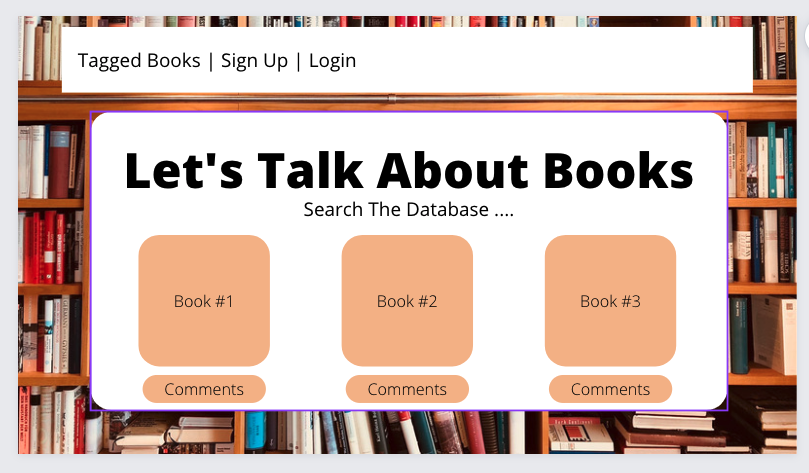
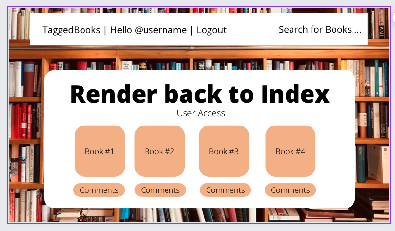
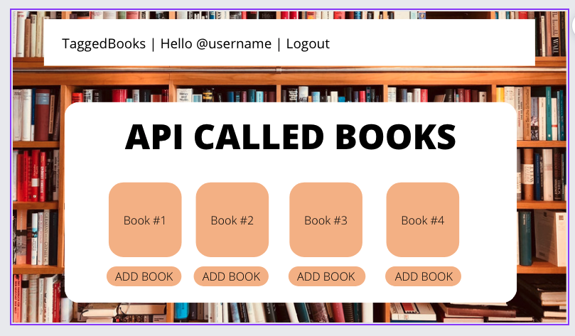
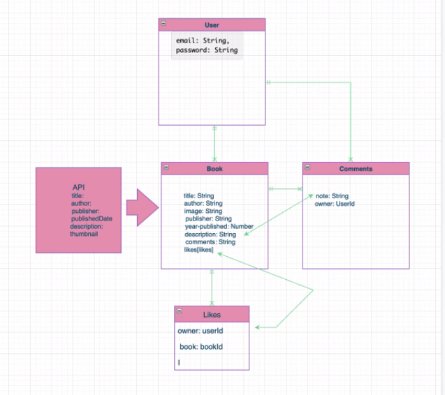

# LETS TALK ABOUT BOOKS!!

### PROJECT PROMPT
A full-stack application utilizing React(front-end) and Express(back-end) for users to start and join conversations about books. 

### USER STORY
1. Unregistered user will be able to navigate to book index (Tagged Books) as home page
2. Unregistered user will be able to sign up(register) using their email
3. Unregistered user can search books, but not Tag them, comment, or like, until login
4. Unregistered user will be able to click on any book on home page (Tagged Books) and go to a show page of that book
5. Unregistered user will be able to enter a book title in a search box and view a show page of the searched book
6. Unregistered user will get feedback saying their search is invalid if they type in an invalid title to a book
7. Unregistered user can view any other credentialed user’s comments from a book’s show page
8. Registered user will be able to sign in
9. Credentialed user will be able to sign out
10. Credentialed user will be able to click on any book on Tagged Books and go to a show page of that book
11. Credentialed user will be able to enter a book title in a search box and view a show page of the searched book
Credentialed user will get feedback saying their search is invalid if they type in an invalid title to a book
12. Credentialed user can add any searched book to the index page with the click of an “Tag” button
13. Credentialed user can choose to delete their own book they added from the via the book’s show page
14. Credentialed user can post comments about a book from the book’s show page
15. Credentialed user can view any other credentialed user’s comments from a book’s show page
16. Credentialed user can delete their own comments from a book’s show page
17. Credentialed user can edit their own past comments on a book’s show page
18. Credentialed user will be redirected to “Tagged Books” page upon login

### WIRE FRAMES

### ERD (entity relationship diagram)

### API
##### GOOGLE BOOKS
##### "https://developers.google.com/books/"

### CREATED BY:
| Role | Name |
| -----|------|
| Team Manager | Ariana Briceno |
| Front End SME | Casey Jones |
| Back End SME(s) | Terrance Wells & Yuntian Zheng |

##### STRETCH GOALS
- auto completing search box that provides suggestions as the user input changes